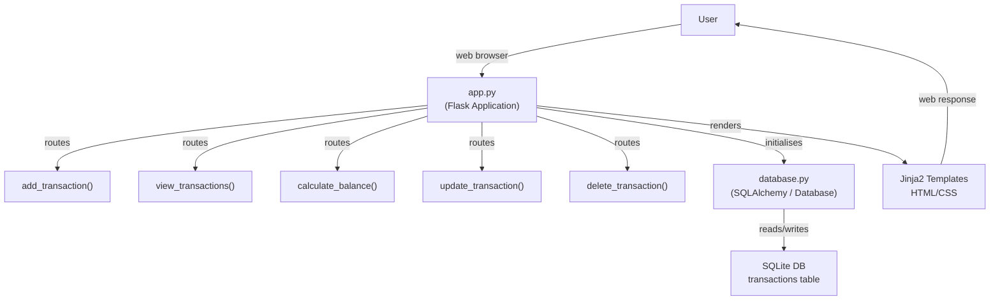

# Personal Expense & Finance Tracker

A beginner-friendly **web-based personal finance management application** built with **Python, Flask, SQLAlchemy, HTML, CSS, and SQLite** to manage personal income and expenses.

## About the Project

The Personal Expense & Finance Tracker is a Flask-based web application that allows users to manage their personal finances through a web interface.

Users can add income and expenses, view transaction history, update or delete transactions, calculate total income and expenses, and check their current balance.

The project was initially developed as a Python command-line application and was later upgraded to a **Flask web application** to practice backend development, database integration, CRUD operations, routing, templates, and SQLAlchemy.

## Features

* Add income
* Add expenses
* View all transactions
* Update transactions
* Delete transactions
* Calculate total income
* Calculate total expenses
* Calculate current balance
* Store transaction data in SQLite
* Form validation
* Dynamic web pages using Jinja2
* Database operations using SQLAlchemy
* Web-based user interface

## Technologies Used

* Python
* Flask
* SQLAlchemy
* SQLite
* HTML
* CSS
* Jinja2
* Git
* GitHub

## Python & Flask Concepts Used

* Variables
* Conditional statements
* Loops
* Functions
* Exception handling
* Modules
* Date handling
* User input
* Flask routing
* HTTP requests and responses
* Jinja2 templates
* CRUD operations
* SQLAlchemy ORM
* Database integration
* Form handling

## Database

The project uses **SQLite** to store transaction data and **SQLAlchemy** to interact with the database.

### Transactions Table

| Column           | Description             |
| ---------------- | ----------------------- |
| id               | Unique transaction ID   |
| transaction_type | Income or Expense       |
| amount           | Transaction amount      |
| category         | Transaction category    |
| description      | Transaction description |
| transaction_date | Date of transaction     |

## Project Structure

```text
Personal-Expense-Finance-Tracker/
│
├── app.py
├── models.py
├── database.py
├── requirements.txt
├── README.md
├── PROJECT_DOCUMENTATION.md
├── .gitignore
│
├── templates/
│   ├── base.html
│   ├── index.html
│   ├── dashboard.html
│   ├── add_transaction.html
│   ├── edit_transaction.html
│   └── transactions.html
│
└── static/
    ├── css/
    └── style.css
  
```

> The exact file structure may vary depending on the current implementation of the project.

## How the Application Works

The application follows a simple Flask web architecture:

```text
User
  ↓
Web Browser
  ↓
Flask Application
  ↓
Routes
  ↓
Business Logic
  ↓
SQLAlchemy
  ↓
SQLite Database
  ↓
Response
  ↓
Jinja2 Template
  ↓
Web Browser
```

## Project Architecture

The application is divided into different components responsible for handling user requests, application logic, and database operations.



## CRUD Operations

The project implements the four basic database operations:

| Operation | Function                       |
| --------- | ------------------------------ |
| Create    | Add a new income or expense    |
| Read      | View transaction history       |
| Update    | Modify an existing transaction |
| Delete    | Remove a transaction           |

## Financial Calculations

The application calculates:

```text
Total Income
Total Expenses
Current Balance
```

The current balance is calculated as:

```text
Balance = Total Income - Total Expenses
```

## Installation

### 1. Clone the Repository

```bash
git clone https://github.com/your-username/Personal-Expense-Finance-Tracker.git
```

### 2. Open the Project

```bash
cd Personal-Expense-Finance-Tracker
```

### 3. Create a Virtual Environment

For Windows:

```bash
python -m venv venv
```

Activate it:

```bash
venv\Scripts\activate
```

### 4. Install Dependencies

```bash
pip install -r requirements.txt
```

### 5. Run the Flask Application

```bash
python app.py
```

Open the URL displayed by Flask in your browser. Usually:

```text
http://127.0.0.1:5000/
```

## Requirements

The project uses Python and Flask along with the required database libraries.

Example `requirements.txt`:

```text
Flask
Flask-SQLAlchemy
```

Add any other packages used by the current project to `requirements.txt`.

## Application Workflow

```text
User
 ↓
Open Website
 ↓
Dashboard
 ↓
Add Income / Expense
 ↓
Save Transaction
 ↓
SQLite Database
 ↓
View Transactions
 ↓
Update / Delete
 ↓
Dashboard
 ↓
Updated Financial Summary
```

## Future Improvements

* User authentication
* Google OAuth login
* User-specific transactions
* Expense charts and graphs
* Monthly financial reports
* Search and filtering
* Export transactions to CSV
* Password reset
* REST API
* PostgreSQL database
* Cloud deployment
* Budget management
* Monthly spending analysis
* Responsive UI improvements

## What I Learned

Through this project, I practiced:

* Python backend development
* Flask application structure
* Flask routing
* Jinja2 templates
* HTML and CSS integration
* SQLAlchemy ORM
* SQLite database integration
* CRUD operations
* Form handling
* Database modeling
* Connecting frontend, backend, and database
* Git and GitHub

## Project Documentation

This project includes a dedicated documentation file:

```text
PROJECT_DOCUMENTATION.md
```

The documentation contains detailed information about:

* Project objectives
* System architecture
* Application workflow
* Database design
* Flask routes
* Database models
* CRUD operations
* Technologies used
* Future improvements

## Author

**Geetika Vishwakarma**

B.Tech – Electronics and Communication Engineering

---

⭐ If you find this project useful, consider giving the repository a star!
