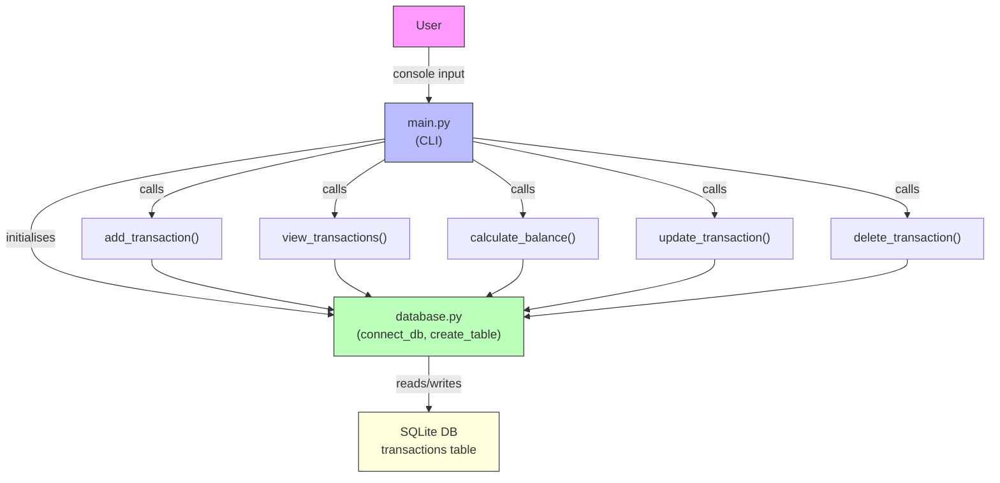

# Personal Expense Finance Tracker — Project Documentation

## Overview

Personal Expense Finance Tracker is a simple command-line application that lets a user record incomes and expenses, view past transactions, update or delete entries, and see a financial summary (balance). The app is implemented in Python and uses SQLite for persistent storage.

## Architecture (Block Diagram)



## Components

- `main.py`: The command-line interface and application logic. It provides the interactive menu and implements the following operations:
  - `add_transaction()` — prompts for type, amount, category, description and persists a new transaction.
  - `view_transactions()` — lists all transactions ordered by newest first.
  - `calculate_balance()` — computes total income, total expense, and balance.
  - `update_transaction()` — loads an existing transaction by ID, prompts for new values, and updates the record.
  - `delete_transaction()` — confirms and deletes a transaction by ID.

- `database.py`: Encapsulates database access and schema management. Typical functions:
  - `connect_db()` — returns a connection (context-manager friendly) to the SQLite database.
  - `create_table()` — ensures the `transactions` table exists on startup.

## Data Model

Table: `transactions`

Columns:

- `id` INTEGER PRIMARY KEY AUTOINCREMENT
- `transaction_type` TEXT NOT NULL   — 'Income' or 'Expense'
- `amount` REAL NOT NULL
- `category` TEXT
- `description` TEXT
- `transaction_date` TEXT (ISO date string)

Example SQL schema:

```sql
CREATE TABLE IF NOT EXISTS transactions (
  id INTEGER PRIMARY KEY AUTOINCREMENT,
  transaction_type TEXT NOT NULL,
  amount REAL NOT NULL,
  category TEXT,
  description TEXT,
  transaction_date TEXT
);
```

## Core Workflows

- Add Transaction:
  1. User selects "Add Transaction" from the CLI.
  2. App asks Income or Expense, amount, category, description.
  3. Application inserts a new row into the `transactions` table with today's date.

- View Transactions:
  1. User selects "View Transactions".
  2. App queries `transactions` ordered by `id DESC` and displays rows.

- Calculate Balance:
  1. App computes SUM(amount) grouped by `transaction_type` where `Income` and `Expense`.
  2. Balance = Total Income − Total Expense.

- Update Transaction:
  1. User provides a transaction `id`.
  2. App loads the row, displays current values, prompts for new values.
  3. App updates the row and sets `transaction_date` to today's date.

- Delete Transaction:
  1. User provides a transaction `id`.
  2. App displays the row and asks for confirmation.
  3. On confirmation, app deletes the row.

## Files

- `main.py` — CLI and business logic.
- `database.py` — database connection and schema setup.
- `requirements.txt` — runtime dependencies (if any).

## Running the Project

1. Ensure Python 3.10+ is installed.
2. (Optional) Create and activate a virtual environment.
3. Install dependencies (if additional packages are listed in `requirements.txt`).
4. Run the app:

```bash
python main.py
```

## Notes & Suggested Improvements

- Add input validation and better error handling for DB operations.
- Support filtering and paging when viewing transactions.
- Add export/import (CSV) and simple reports by date ranges.
- Add tests for database functions and core flows.

---

If you want, I can also: add a README section that includes the diagram, or convert this into HTML/PDF for sharing.
