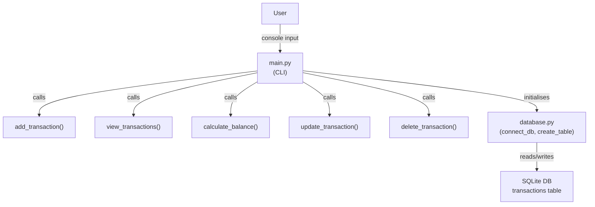

# Personal Expense & Finance Tracker

A beginner-friendly command-line application built with Python and SQLite to manage personal income and expenses.

## About the Project

The Personal Expense & Finance Tracker allows users to record their income and expenses, view transaction history, calculate their total income and expenses, check their current balance, and delete transactions.

The project was developed to practice Python programming, SQLite database operations, CRUD concepts, and basic financial calculations.

## Features

- Add income
- Add expenses
- View all transactions
- Calculate total income
- Calculate total expenses
- Calculate current balance
- Delete transactions
- Store transaction data in SQLite
- Basic input validation

## Technologies Used

- Python
- SQLite
- SQL
- Git
- GitHub

## Python Concepts Used

- Variables
- Conditional statements
- Loops
- Functions
- Exception handling
- Modules
- Date handling
- User input

## Database

The project uses SQLite to store transaction data.

### Transactions Table

| Column | Description |
|---|---|
| id | Unique transaction ID |
| transaction_type | Income or Expense |
| amount | Transaction amount |
| category | Transaction category |
| description | Transaction description |
| transaction_date | Date of transaction |

## Project Structure

```text
Personal-Expense-Finance-Tracker/
│
├── main.py
├── database.py
├── README.md
├── requirements.txt
└── .gitignore
```

## Run

Run the app with a Python 3.8+ interpreter:

```bash
python main.py
```

No external dependencies are required; the app uses the standard library and SQLite.

## Project Documentation

This project includes a dedicated documentation file with an architecture diagram and detailed descriptions of components and workflows. See `PROJECT_DOCUMENTATION.md` for the full content. A condensed version of the architecture is shown below.



For the full documentation, including data model, example SQL schema, and suggested improvements, open [PROJECT_DOCUMENTATION.md](PROJECT_DOCUMENTATION.md).